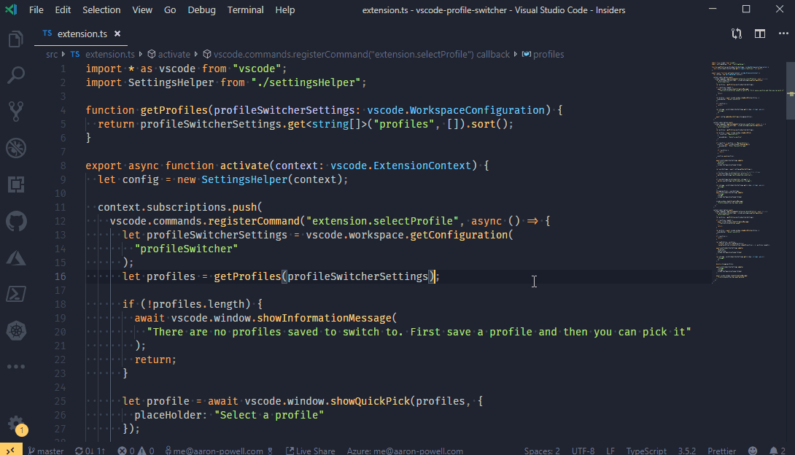

# VS Code Profile Switcher

| Job                 | Status                                                                                                                                                                                                                                                                                         |
| ------------------- | ---------------------------------------------------------------------------------------------------------------------------------------------------------------------------------------------------------------------------------------------------------------------------------------------- |
| Overall             |                  |
| Linux (Node 10.x)   |    |
| Linux (Node 12.x)   |    |
| Windows (Node 10.x) |  |
| macOS (Node 10.x)   |    |

 
 

This extension allows you to define a number of settings profiles that you can easily switch between. The original idea for this extension came from my desire to have an easy way for me to switch my VS Code to a setup that was better optimised for presenting (changed themes, increase font size, etc).

## Install

- Open **Extensions** sidebar panel in Visual Studio Code. `View → Extensions`
- Search for `Profile Switcher`
- Click **Install**
- Click **Reload**, if required

## Features

The extension introduces four new commands that you can use from the command panel. All commands are prefixed with `Profile Switcher`.

### Save Profile

This saved the current **user** settings with the name you provide. You can use this to create a new profile or you can update an existing profile. The profile, when saved, is done so against your user-level settings.

Extensions that are installed are stored with the profile. See [Extensions](#extensions) for more information on how Extensions are handled.

_Note: This looks at the settings at the **user** level and not the workspace._

### Select Profile

This allows you to select a previously saved profile. It'll replace it at the **user** level, not the **workspace** level. It works by merging your saved settings over the top of your current settings.

The extensions that are linked to the profile will be installed and extensions that weren't in the profile are removed. See [extensions](#extensions) for more information on how Extensions are handled.

### Delete Profile

This removed a previously saved profile.

### Select Live Share Profile

This will set a previously saved profile as the default profile to be used on [VS Code Live Share](https://visualstudio.microsoft.com/services/live-share/?WT.mc_id=javascript-11196-aapowell).

Once set, when you launch a Live Share session your profile will be automatically enabled, and then once your session ends the previous profile will be loaded. Thanks [@lostintangent](https://github.com/lostintangent) for [the PR that included it](https://github.com/aaronpowell/vscode-profile-switcher/pull/4).

## Extensions

A profile isn't just the settings you have enabled, but also the extensions that were installed. This allows you to create different profiles for different styles of development (e.g. a React profile and a Vue profile, loading their respective extensions only).

When you switch profiles the extension will attempt to be intelligent about how the extensions are removed but moving them to the Profile Switcher [`globalStoragePath`](https://code.visualstudio.com/api/references/vscode-api?WT.mc_id=javascript-11196-aapowell#ExtensionContext) before removing them. Then, when you need to install the extensions again it will attempt to get them from that location rather than having to download them from the marketplace (it'll fallback to marketplace if required).

### Always On Extensions

There are some extensions you might always enabled, regardless of profile (such as Settings Sync). To support this there is a property called `extensionsIgnore` which is an array of extension ID's that will be ignored when switching profiles. By default it includes Settings Sync and Live Share.

## Changes

See the [CHANGELOG](CHANGELOG.md) for the latest changes.

## Roadmap

Got an idea for what you'd like this extension to do? Feel free to [create an issue or pick up an open issue](https://github.com/aaronpowell/vscode-profile-switcher/issues).

## Resources

Want to build your own extensions? Here's some starting points

- [Get VS Code](https://code.visualstudio.com/?WT.mc_id=javascript-11196-aapowell)
- [Create your first VS Code extension](https://code.visualstudio.com/api/get-started/your-first-extension?WT.mc_id=javascript-11196-aapowell)
- [VS Code Extension API](https://code.visualstudio.com/api/references/vscode-api?WT.mc_id=javascript-11196-aapowell)
- [Learn how to add WebPack bundles to your favorite extensions](https://code.visualstudio.com/updates/v1_32?WT.mc_id=javascript-11196-aapowell#_bundling-extensions-with-webpack?wt.mc_id=profileswitcher-github-aapowell)

## Credits

This was my first time trying to build an extension for VS Code and wouldn't have got this far without:

- The VS Code team's [in depth guide to extensions](https://code.visualstudio.com/api/get-started/your-first-extension?WT.mc_id=javascript-11196-aapowell)
- Looking through the [example extensions](https://github.com/Microsoft/vscode-extension-samples) on the VS Code team's GitHub
- [John Papa's Peacock extension](https://github.com/johnpapa/vscode-peacock)
- [VS Code Settings Sync](https://marketplace.visualstudio.com/items?itemName=Shan.code-settings-sync&WT.mc_id=javascript-11196-aapowell) that helped me understand how to find settings on a machine
